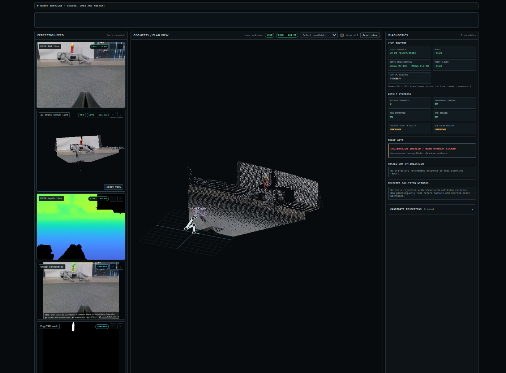
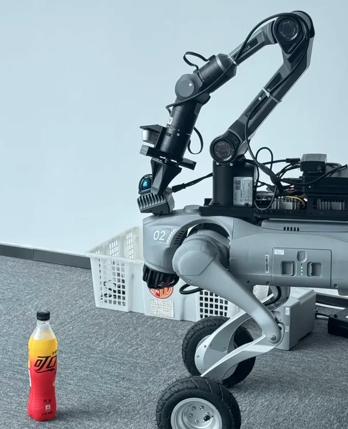
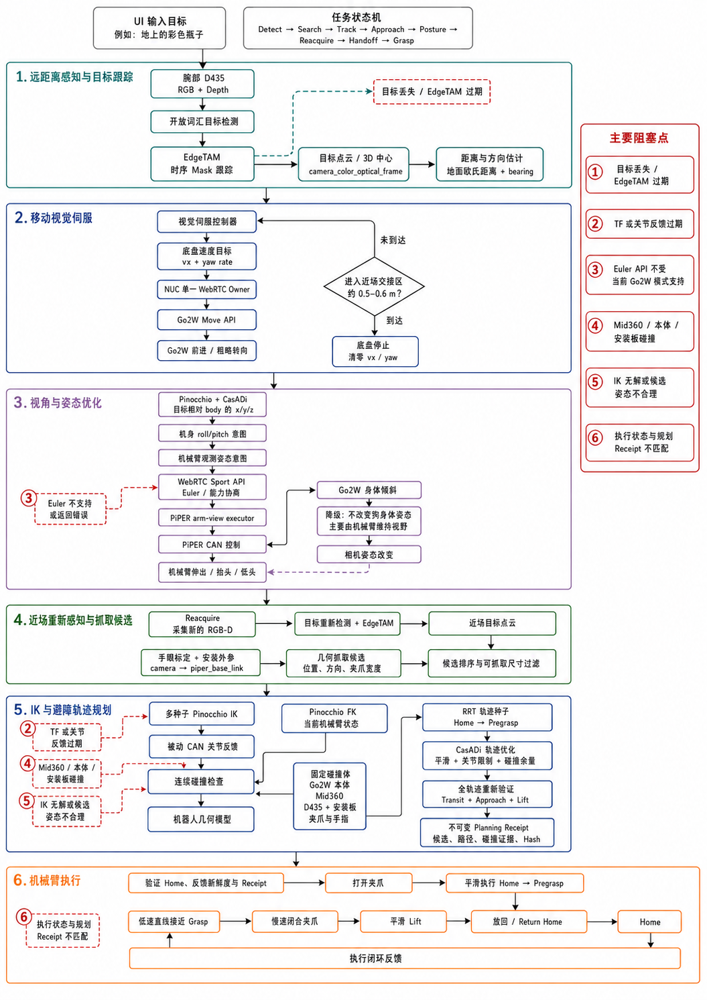

# Z-Mobile-Manip

Supervised mobile manipulation for a Unitree Go2-W EDU quadruped carrying an AgileX PiPER
6-DoF arm and a wrist-mounted Intel RealSense D435.



## What this repository is

Z-Mobile-Manip is the **near-field half** of a three-repository stack: an external navigation
layer drives the robot to a coarse standoff, and this system takes over from roughly a metre
out and runs through to a completed grasp and return. Compute is split between an RTX 4090
workstation (perception, grasp synthesis, IK, planning, operator UI) and the robot's onboard
NUC (D435 driver, PiPER `can0`, passive joint feedback, Go2-W WebRTC base transport), joined
over `ROS_DOMAIN_ID=20`. The perception chain grounds an open-vocabulary text target with
**YOLOE**, tracks it with **EdgeTAM**, and back-projects it against **Fast-FoundationStereo**
depth rather than the D435's raw stream; the resulting target cloud feeds both a reactive depth
servo and grasp synthesis. Grasps come from **AnyGrasp** with a local antipodal generator as
fallback, are solved by a damped Gauss-Newton **Pinocchio** IK over the six arm joints, and are
checked against two collision models — a capsule model of the platform's own fixed fixtures
(`configs/piper_collision_capsules.json`, the only enforced representation of the chassis, NUC
and Mid-360 LiDAR) and an observed point-cloud model of the scene. Approach and lift
trajectories come from **RRT-Connect** with quintic time parameterisation, optionally refined
by **CasADi**, which also solves the 10-DoF whole-body QP coupling base forward/yaw and body
roll/pitch to the six arm joints during the servo approach. Motion is executed by short-lived,
content-addressed executors copied to the NUC per run, so the arm is never driven by a
long-lived process. Seven ROS 2 packages (`z_manip_edgetam`, `z_manip_motion`,
`z_manip_navigation`, `z_manip_place`, `z_manip_rgbd_bridge`, `z_manip_ros`, `z_manip_task`)
carry the bridges, and separate Docker images isolate the GPU workloads
(`z-manip-runtime:pinocchio` for ROS 2 + Pinocchio + the baked ROS packages, plus EdgeTAM,
YOLOE, AnyGrasp, FFS and whole-body runtimes).

The integration seam is `z_manip_navigation`, which owns coarse approach as its own state
machine (`NavPhase`: idle → wait_observation → navigating → reacquire → ready/failed) and hands
over at `near_target_depth_m = 1.4` once the base has settled below `still_speed_mps = 0.035`.
From there the near-field servo owns the base. Everything crossing a process boundary is a
versioned JSON document — 79 `z_manip.*.vN` schemas, of which `depth_servo_status.v1` is the
one the supervisor polls (the servo rewrites it at 20 Hz) and `depth_servo_trace.v1` is the
per-tick record to reach for first when something misbehaves, because it carries the phase, the
reason string, the target age, the collision witness and both the proposed and the published
command on every row. Servo state is a single enum with one policy table (`z_manip/control/servo_phase.py`): every
phase carries a deadline, an expiry action, an expected base owner and a terminal flag, and a
phase string nobody declared inherits a fail-closed policy rather than running unbounded.
Execution leaves an audit trail of stage receipts (start, per-stage joints, gripper verdicts,
final pose) that the offline tests replay, which is why most regressions here are caught against
recorded runs rather than in simulation.

Every stage is **fail-closed**: a missing calibration, a stale transform, an unproven collision
corridor or an unreported servo phase stops the robot rather than proceeding, and each stop
carries a named reason into the status document. Two things an integrator should know before
trusting anything: the Go2-W `wheeled_sport` interface exposes no `Euler` or `BodyHeight`
service, so the whole-body QP's body roll/pitch DOFs are locked to zero on this platform and
posture control is effectively unavailable; and `pinocchio`/`casadi` are absent from some hosts,
so a green test suite does not mean the IK or QP numerical paths ran. Thresholds and guards are
commented with the incident that motivated them — treat those comments as normative, because
several are not derivable from the code alone, and more than one has been silently reverted by
someone who assumed otherwise.

Two chains run on real hardware today:

- **Fixed base** — `perception → planning → grasp → return Home`
- **Mobile** — `find/track → depth approach → stop → close-range grasp`



This is a supervised laboratory system, not an unattended product. Keep clearance around the
robot and the physical e-stop in reach during any motion test.

## Architecture

| Location | Responsibility |
|---|---|
| 4090 workstation | RGB-D decode, grounding and tracking, point clouds, grasp synthesis, IK, planning, UI |
| Go2-W NUC | D435 ROS service, PiPER `can0`, passive joint feedback, per-run executors, base WebRTC |
| Browser | Perception, planning, execution, Home/reset, Full Stop, diagnostics |

```text
target text → RGB-D grounding → EdgeTAM tracking → target point cloud
→ coarse align, depth-closed-loop approach → stop at ~0.50 m → near-field re-perception
→ grasp candidates → Pinocchio IK → collision check and path planning
→ pregrasp → approach → slow close → smooth lift → Home
```



Two deployment properties matter before changing anything:

- `z_manip/**` and `scripts/runtime/**` are **bind-mounted read-only from this checkout** and
  run directly from it. Editing the working tree is a live deploy to a powered-up robot.
- `ros2/**` is **baked** into `z-manip-runtime:pinocchio`, rebuilt with
  `scripts/runtime/go2w_perception_lab.sh build` — not with `docker compose`, which targets a
  stale `:jazzy` tag.

## Requirements

- Ubuntu 24.04, ROS 2 Jazzy, CycloneDDS, Docker with the NVIDIA Container Toolkit
- RTX 4090 (24 GB) workstation; Go2-W EDU with SSH-reachable onboard NUC
- AgileX PiPER on 1 Mbps SocketCAN with a matching URDF; wrist RealSense D435/D435i
- Time-synced PC and NUC on the same segment, identical ROS Domain ID

Base transport uses the third-party `unitree_webrtc_connect`; the PiPER backend uses
`pyAgxArm`. AnyGrasp is an optional backend whose SDK, license and weights are not included
here. See [THIRD_PARTY_NOTICES.md](THIRD_PARTY_NOTICES.md).

## Getting started

```bash
scripts/runtime/manip up          # bring up the full stack
scripts/runtime/manip status      # per-component health, publish rates, transports
```

The workbench serves on `127.0.0.1:8766`. First-time setup — hand-eye calibration, mount
extrinsics, NUC provisioning — is in `docs/piper_mount_and_kinematic_calibration.md` and
`docs/component_manager.md`. Calibration is not optional: the frame gate refuses to plan
without measured, non-synthetic calibration evidence.

## Safety boundaries

- No motion command is issued without a validated collision corridor and fresh joint feedback.
- On fault the arm is left torqued while holding an object; the electronic e-stop fires only
  when the gripper is provably empty.
- Every phase the servo can emit carries a deadline and a terminal action; an unlisted phase
  fails closed (`z_manip/control/servo_phase.py`).
- Full Stop in the UI and the physical e-stop are independent paths.

## Verification

```bash
python3 -m pytest -q          # offline contract and regression suite
```

`pinocchio` and `casadi` are not importable on every host; tests covering those paths skip
rather than fail, so a green suite does not imply the IK or QP numerical paths were exercised.
Live-hardware checks sit behind a read-only health probe and skip when the chain is down.

## Layout

```text
z_manip/         perception, grasp, IK, planning and runtime modules
scripts/runtime/ manip CLI, bringup, diagnostics, visual servo, executors
web/             local operator and debug workbench
ros2/            ROS 2 bridges, observers and interface packages
configs/         schemas, collision model, service units, sample configs
docker/          GPU inference and planning runtimes
tests/           unit, contract and regression tests
docs/            operations, calibration, configuration, acceptance
```

## Documentation

- [Real-robot operations and recovery](docs/go2w_piper_operations.md)
- [Component manager and one-shot bringup](docs/component_manager.md)
- [Configuration schema and migration](docs/configuration.md)
- [Mount extrinsics and kinematic calibration](docs/piper_mount_and_kinematic_calibration.md)
- [Mobile manipulation acceptance](docs/mobile-manipulation-acceptance.md)
- [Staged pick-and-hold contract](docs/staged_pick_hold_contract.md)
- [Architecture blueprint and roadmap](docs/plan.md)

## License

[PolyForm Noncommercial License 1.0.0](LICENSE) — use, modification and redistribution are
permitted for noncommercial purposes only. Commercial use requires a separate license.

Third-party software, models, robot SDKs and trademarks remain subject to their own licenses
and rights. This project is not affiliated with, sponsored by, or endorsed by Unitree Robotics,
AgileX Robotics, Intel, NVIDIA or their affiliates.
